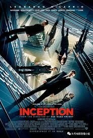

# Xlin0975_9103_tut09

## Week 8 quiz

### Part 1: Imaging Technique Inspiration
* I wanted to choose the dream folding scene from the movie Inception showing the cityscape visually bending and folding as a source of inspiration for my project.

I hope to learn from the composition of superposition and repetition: the scene in the dream has a large number of parallel repetitive structures, but they are twisted and superimposed on each other, forming a psychedelic visual impact. I think we can try to use different levels of rotation, scaling and other movements in p5.js to make similar graphic elements produce this kind of repeated but irregular superposition effect.

